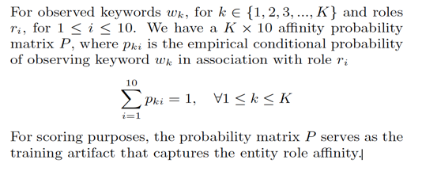
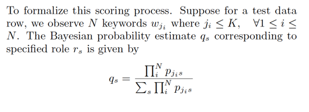
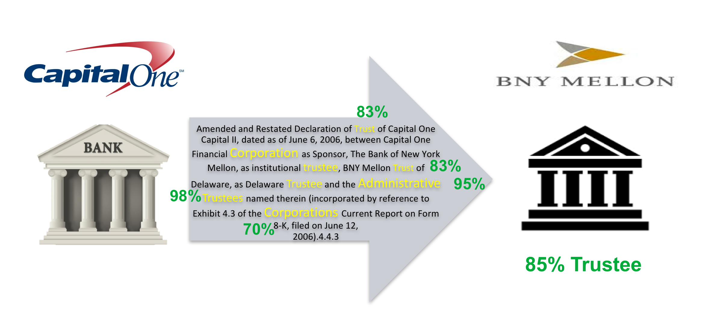

</img>

## AUTOMATION UPDATES

 

### Bharath Kallu
### May, 2017

 

---

## Agenda

* Introduction
* Motivation for approach
* Mathematical formulation
* Implementation details
* Sample result
* Future improvements

---

## Introduction 

* **FEIII Challenge**: Identify and understand the relationships among financial entities and the roles that they play in financial contracts using filing documents
  *  Data is sourced for 10-K and 10-Q filings
  *  Data points provide filing entity, mentioned entity and role
  *  Each data point has "three sentences" that helped make the assessment
  *  Expert labels mark relevance of "three sentences" to assess role/relationship between entities 

* Tractable scoring task:
  *  Rank unlabeled filings with pre-extracted filing entity, mentioned entity and role in order of decreasing relevance of "three sentences" to make the role assessment
  *  Submissions are scored using NDCG (Normalized discounted cumulative gain)
  

* **Research output** from these tasks is used by **OFR** to improve automated detection of relationships between financial entities

---
## Motivation for approach 

* **Hypothesis**: Certain words (i.e. keywords) observed in the text excerpts capture disproportionate information to infer the role/relationship between entity pairs

<!-- .element width="100%" -->

---

## Mathematical formulation 

* Role affinity estimation:

  * For each extracted keyword, we estimate empirical probability of assoicating with each role

  * This empirical probability is only computed from samples with positive relevance labels

<!-- .element width="70%" -->

* Test Data Scoring

  * Our score for each text-role pair is based on a cumulative Bayesian probability estimate over all observed keywords

<!-- .element width="80%" -->

---
## Implementation Detail

* High Level Approach

  * Role specific **keyword affinity** is estimated using positively labeled (relevant/ highly relevant) training data points

  * Scoring of text snippets from test data is the cumulative **Bayesian ML**(maximum likelihood) of observing all keywords

## Implementation specifics

* Pre-processing

  *  Ingest, clean and normalize the data

  *  Convert text ratings to numeric and average assessment from all experts

* Keyword extraction

  *  Convert sentences to collection of words normalized to lowercase

  *  Suppress stop words, numeric and control characters, financial entity names

## Implementation specifics

* Affinity Estimation

  *  Positive labeled training data is used to obtain empirical role-keyword affinity (probability estimates)

  *  We add a uniform epsilon probability to account for unobserved keyword-role pairs in training data to regularize cumulative Bayesian estimation 

---
## Result: Example Scoring

* Affinity of keywords in the original filing to the role of "trustee" is shown below

* Cumulative Bayesian ML estimate places a 85% likelihood for BNY Mellon as a trustee

<!-- .element width="90%" -->

---
## Future improvements

* Keyword Extraction: 

  * Use POS tagging to limit keywords used for affinity estimation

  * Use negative/unlabeled data to improve confidence on relevance of a keyword

## Future improvements

* Affinity Estimation:
  
  * Limited sample-size produces noisy empirical probabilities. Use keyword "root" similarities to propagate affinities
  
  * Use keyword co-occurrence data to perform higher order probabilistic inference
  
  * Improve heuristic handling of unobserved keyword-role pairs

## Future improvements

* Scoring:

  * Limit scoring to highly polarized/ confident keywords

  * Better cumulative probability estimation to resolve disparities in keyword affinities towards different roles
---

## Thank You
==========
